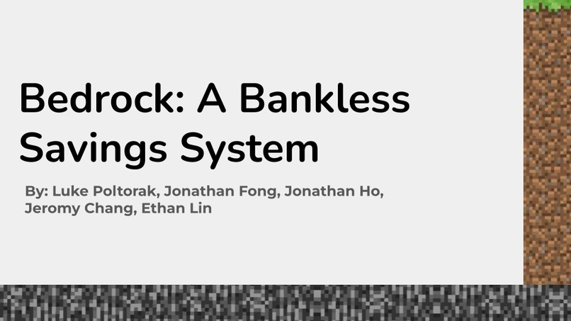
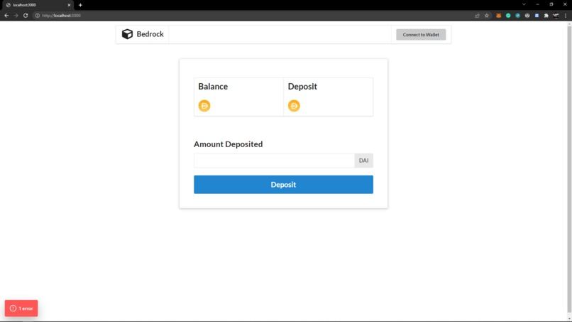

# Bedrock - A Bankless Savings System

Nearly 1.7 Billion people in the world don't have access to banking infrastructure. Bedrock allows anyone with an internet connection to create a savings account and build their wealth.

## Inspiration
The five of us came together because of our shared love of blockchain technology. We all believe that it has the potential to lift billions out of poverty by giving them access to financial infrastructure that they wouldn't have otherwise. Historically, decentralized finance has been a playground for risky, speculative investing; we began this project by asking ourselves: what if we tried to build a defi app for the everyday person?

## What it does
Bedrock is a web application that allows anyone with an internet connection to create a savings account without the need for a bank. We have leveraged defi to create an open-source, uncensorable, and safe way to store and grow your money. This is possible through the use of smart contracts on Ethereum, as well as using financial primitives already built onto the blockchain.

## How we built it
We leveraged Truffle to help us set up a development environment and develop the boilerplate code. We then built our UI in React and our smart contracts in Solidity. Once the contracts were complete we deployed them onto the Rinkeby Ethereum testnet using Remix IDE. The front-end is able to communicate with the deployed contracts using web3.js.

## Challenges we ran into
Since the decentralized finance industry is only about two years old, there were relatively few tools and resources to help us achieve our goals. Many of the libraries we wanted to import weren't fully functional and some of the smart contract bugs we encountered had yet to be solved online.

## Accomplishments that we're proud of
We're really proud of how we managed to build a complete product with both front-end functionality and smart contracts that interact with one of the world's best defi protocols.

## What we learned
We have learned that building a fully-featured application requires a ton of organizational skills. We had initially thought that we would spend all of our time coding, but we ultimately spent several hours planning, scheduling, and designing our app to make sure we hit all of our goals.

## What's next for Bedrock - A Bankless Savings Account
In the future, we would like to expand the services offered by Bedrock to include more diverse, capital-efficient strategies. We would also like to create a Decentralized Autonomous Organization(DAO) to officiate any changes to Bedrock's code and to allow our clients to have a share in the project.